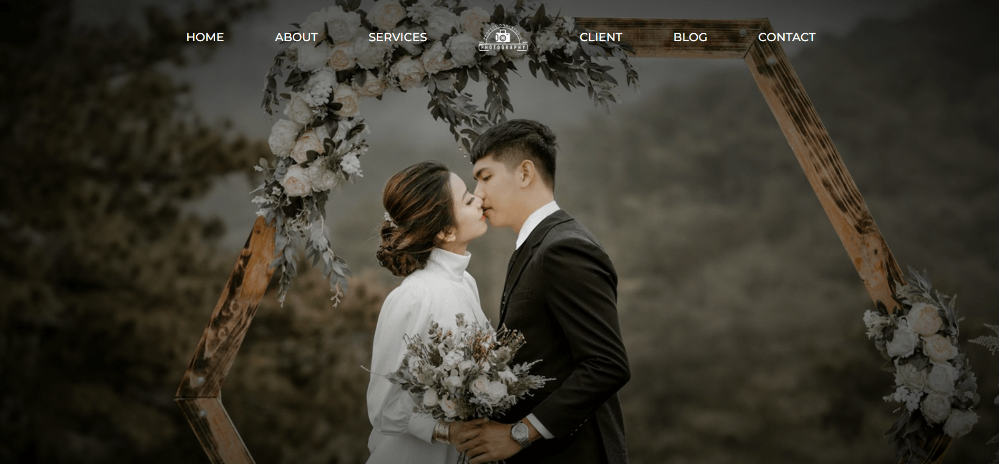

<div align="center">
 <a href="https://web-design-capture.netlify.app/" target="_blanck"></a>
 <div align="center">
 
 
 </div>
  <h3 align="center">Web Design Capture</h3>
</div>

## <br /> 📋 <a name="table">Summary</a>

- ✨ [Introduction](#introduction)
- 🛠 [Technology Used](#tech-stack)
- 🚀 [Launch App](#launch-app)

## <br /> <a name="introduction">✨ Introduction</a>

**[ENG]** Capture is a photography company offering a wide range of professional services. This responsive web page adapts seamlessly across all devices—desktop, tablet, and mobile—while leveraging smooth animations for an engaging and intuitive user experience.

**[FR]** Capture est une entreprise de photographie proposant une gamme complète de services professionnels. Cette page web responsive s’adapte parfaitement à tous les appareils (ordinateur, tablette, mobile) et intègre des animations fluides pour une expérience utilisateur immersive et intuitive.


## <br /> <a name="tech-stack">🛠 Technology Used</a>

- [ScrollReveal](https://scrollrevealjs.org/) Adds animation effects to elements on a webpage as they scroll into view.

- [Swipper](https://swiperjs.com/get-started)
Creates touch-enabled sliders (carousels) for showcasing images, content, or products.

## <br /> <a name="launch-app">🚀 Launch App</a>

Follow these steps to set up the project locally on your machine.

**Prerequisites**

>[!NOTE]
> Make sure you have the following installed on your machine:

- [Git](https://git-scm.com/)
- [Node.js](https://nodejs.org/en)
- [npm](https://www.npmjs.com/) *(Node Package Manager)*

**Cloning the Repository**

```bash
git clone {git remote URL}
cd {git project..}
```

**Installation**

> After cloning the repository, run the command `npm i` or `yarn i` to install the project's dependencies.

> Run the development server:

### `npm start`

Runs the app in the development mode.\
Open [http://localhost:3000](http://localhost:3000) to view it in your browser.

The page will reload when you make changes.\
You may also see any lint errors in the console.

### `npm test`

Launches the test runner in the interactive watch mode.\
See the section about [running tests](https://facebook.github.io/create-react-app/docs/running-tests) for more information.

### `npm run build`

Builds the app for production to the `build` folder.\
It correctly bundles React in production mode and optimizes the build for the best performance.

The build is minified and the filenames include the hashes.\
Your app is ready to be deployed!

See the section about [deployment](https://facebook.github.io/create-react-app/docs/deployment) for more information.
