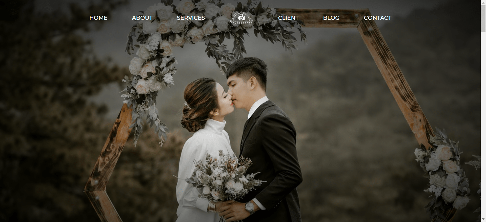

<div align="center">
 
  <h3 align="center">Web Design Capture</h3>
</div>

## <br /> 📋 <a name="table">Summary</a>

- [Introduction](#introduction)
- [Technology Used](#tech-stack)
- [Launch App](#launch-app)

## <br /> <a name="introduction">✨ Introduction</a>

The Capture Web page is a company who proposes a range of professional photography services.
I build responsive websites that adapt seamlessly to all devices (desktop, tablet, mobile) and utilize smooth animations to create an engaging and intuitive user experience.

<<<<<<< HEAD
## <br /> <a name="tech-stack">🛠 Technology Used</a>

- **ScrollReveal** : adds animation effects to elements on a webpage as they scroll into view.

- **Swipper JS** : creates touch-enabled sliders (carousels) for showcasing images, content, or products.

## <br /> <a name="launch-app">🚀 Launch App</a>

<br/>**Cloning the Repository**

```bash
git clone {git remote URL}
```

<br/>**installation**

> After cloning the repository, with the extention `live server` from VScode , click on `Go live` to run live server
